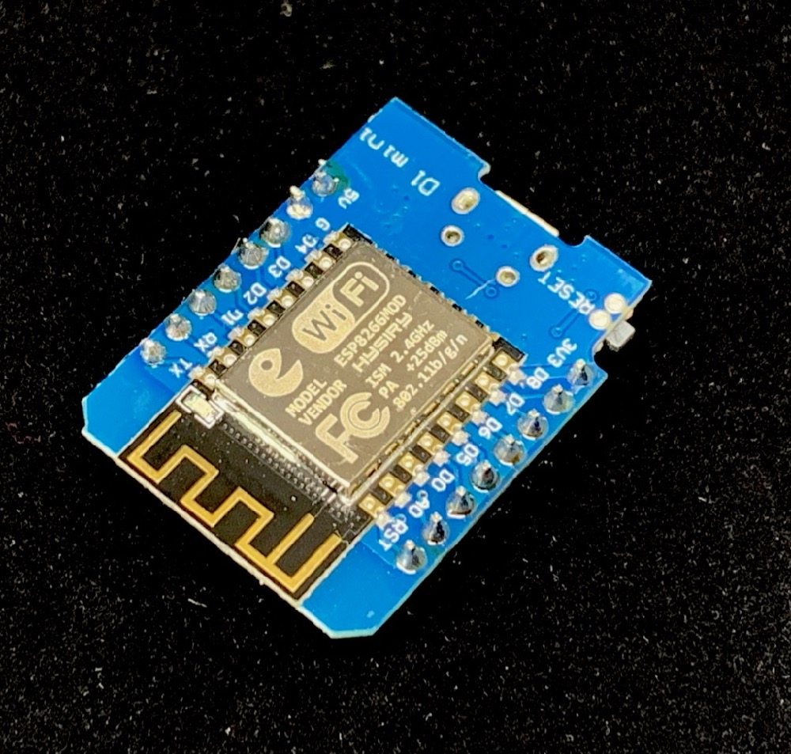

# From Sensor to Graph

---

## DHT22


- Sensor with both temperature and humidty
- Three pins to connect to arduino
  - power - ground - data

---

## ESP8266



- Wemos D1 mini
- Inbuilt WiFi
- 80MHz chip

---

## ESP32


- D32
- Inbuilt WiFi
- Bluetooth
- 160MHz chip
- + lots more

---

## Raspberry PI


- Rasbperry Pi 3B+

---

## MQTT

- Simple publish/subscribe server designed for IoT usage
- Publish bytes of data to a topic
- Subscribe to the topic and get sent bytes of data

---

## Arduino coding

Basically C++ with some extras

---

### DHT22

```c++
dht DHT;

DHT.read22(D1);

float temperature = DHT.temperature;
float humidity = DHT.humidity;
```

---

### MQTT

```c++
// Create and configure
PubSubClient client(wifiClient);
client.setServer(MQTT_SERVER, 1883);

// Connect
client.connect(CLIENT_NAME, MQTT_USER, MQTT_PASSWORD);

// Publish
client.publish(MQTT_TOPIC, message);
```

---

## Demo

### Arduino Serial Console

Let's take a quick look at what the arduino is saying

---


---

### Demo

Node-RED pipelines - debug node

---

## Influx DB

> InfluxDB is an open-source time series database [^2]

[^2]: [https://en.wikipedia.org/wiki/InfluxDB](https://en.wikipedia.org/wiki/InfluxDB)

---

### Demo

InfluxDB data

---

## Grafana

> Grafana is an open-source, general purpose dashboard and graph composer, which runs as a web application [^3]

[^3]: [https://wiki.archlinux.org/index.php/Grafana](https://wiki.archlinux.org/index.php/Grafana)

---

### Demo

Sensor data on Grafana graph

---

## Links

- Video from Andreas Spiess:

  - https://www.youtube.com/watch?v=JdV4x925au0

- The installation script:
  - https://tech.scargill.net/the-script/
